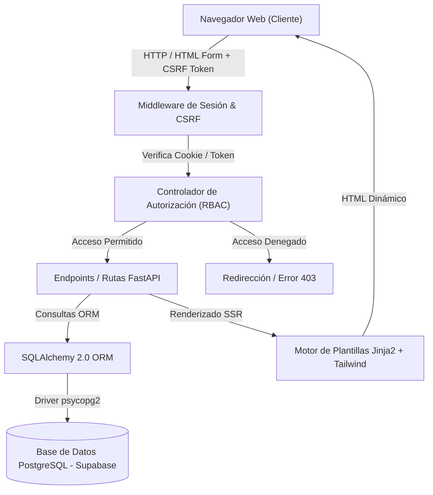
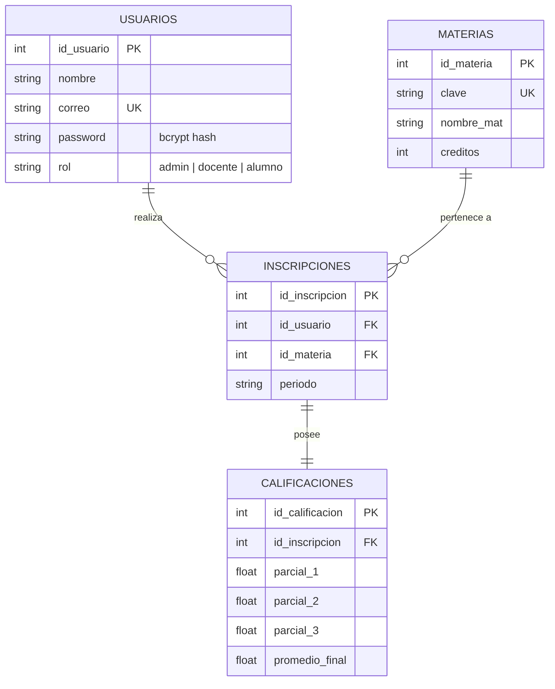

# Control Escolar UMB — Sistema Web de Gestión Escolar


Sistema web full-stack para el control escolar de la Universidad Misantla / UMB. Diseñado para la gestión integral de usuarios (alumnos, docentes y administradores), materias, inscripciones y calificaciones, incluyendo autenticación mediante sesiones, protección CSRF y control de acceso basado en roles (RBAC).

---

## Características Principales

### Gestión CRUD Integral

| Entidad | Crear | Leer | Editar | Eliminar |
|---|:---:|:---:|:---:|:---:|
| **Usuarios** (Alumno, Docente, Administrador) | ✓ | ✓ | ✓ | ✓ |
| **Materias** (Clave, Nombre, Créditos) | ✓ | ✓ | ✓ | ✓ |
| **Inscripciones** (Alumno ↔ Materia, Periodo) | ✓ | ✓ | ✓ | ✓ |
| **Calificaciones** (3 Parciales + Promedio Final) | ✓ | ✓ | ✓ | — |

### Lógica de Negocio y Reglas de Dominio
- **Cálculo automático de promedio**: El sistema procesa los 3 parciales y recalcula automáticamente la calificación final (rango 0–10) con indicadores visuales de desempeño.
- **Generación automática de registros**: Al inscribir a un alumno en una materia, se inicializa automáticamente su expediente de calificaciones en `0.00`.
- **Restricción de unicidad**: Control de inscripción única por alumno, materia y periodo tanto a nivel de controladores como mediante restricciones de base de datos (`UNIQUE`).
- **Integridad referencial y bajas en cascada**: Eliminación automática en cascada para evitar registros huérfanoses de inscripciones o calificaciones al eliminar usuarios o materias.
- **Validación de entradas y modales interactivos**: Modales responsivos para edición y confirmación de eliminación con validación de formularios en tiempo de ejecución.

---

## Arquitectura y Flujo del Sistema



---

## Modelo de Datos



---

## Seguridad

- **Autenticación Basada en Sesiones**: Firma de cookies cifradas mediante `itsdangerous` y `SessionMiddleware` de Starlette.
- **Protección de Contraseñas**: Encriptación unidireccional con **bcrypt**. Migración transparente de contraseñas anteriores al primer login exitoso.
- **Protección contra CSRF**: Verificación de tokens únicos por sesión en todas las peticiones de mutación (`POST`).
- **Control de Acceso Basado en Roles (RBAC)**:

| Rol | Gestión de Usuarios | Gestión de Materias | Inscripciones | Calificaciones |
|---|:---:|:---:|:---:|:---:|
| **Administrador** | Lectura / Escritura | Lectura / Escritura | Lectura / Escritura | Lectura / Escritura |
| **Docente** | Sin acceso | Lectura / Escritura | Lectura / Escritura | Lectura / Escritura |
| **Alumno** | Sin acceso | Sin acceso | Sin acceso | Solo lectura |

- **Mitigación de Ataques**: Bloqueo temporal por 60 segundos tras 5 intentos fallidos consecutivos de inicio de sesión.
- **Cabeceras HTTP Seguras**: `X-Content-Type-Options: nosniff`, `X-Frame-Options: DENY`, `Referrer-Policy: same-origin`.

---

## Tecnologías Utilizadas

| Capa / Componente | Tecnología |
|---|---|
| **Lenguaje Backend** | Python 3.10+ |
| **Framework Web** | FastAPI, Uvicorn |
| **Capa de Datos (ORM)** | SQLAlchemy 2.0 |
| **Base de Datos** | PostgreSQL (Supabase) |
| **Motor de Plantillas** | Jinja2 (Server-Side Rendering) |
| **Diseño / Estilos** | Tailwind CSS, Font Awesome, Google Fonts |
| **Seguridad** | bcrypt, itsdangerous, python-dotenv |
| **Plataforma de Despliegue** | Vercel (Serverless Functions) |

---

## Estructura del Proyecto

```text
control-escolar-web/
├── main.py              # Controlador principal, rutas FastAPI, validaciones y RBAC
├── models.py            # Definición de modelos relacionales SQLAlchemy
├── database.py          # Configuración del motor PostgreSQL y sesiones DB
├── security.py          # Módulo de encriptación bcrypt y utilidades de seguridad
├── create_table.py      # Script de inicialización de esquema y administrador inicial
├── requirements.txt     # Listado de dependencias del proyecto
├── vercel.json          # Archivo de configuración para despliegue en Vercel
├── .env.example         # Plantilla de variables de entorno de desarrollo
├── api/
│   └── index.py         # Punto de entrada para Serverless en Vercel
└── templates/
    ├── base.html        # Plantilla base (Layout, navegación y modales comunes)
    ├── index.html       # Dashboard principal con panel de control multi-pestaña
    └── login.html       # Vista de autenticación de usuarios
```

---

## Instalación y Configuración Local

### 1. Requisitos Previos
- Python 3.10 o superior instalado.
- Instancia de PostgreSQL (se recomienda Supabase).

### 2. Clonación e Instalación

```bash
git clone https://github.com/AndresMondragon2004/Sistema-de-control-escolar.git
cd control-escolar-web

# Creación del entorno virtual
python -m venv venv

# Activación del entorno virtual (Windows)
venv\Scripts\activate

# Activación del entorno virtual (macOS / Linux)
source venv/bin/activate

# Instalación de dependencias
pip install -r requirements.txt
```

### 3. Variables de Entorno

Copia el archivo de ejemplo `.env.example` a `.env` y configura los valores requeridos:

```bash
cp .env.example .env
```

| Variable | Descripción |
|---|---|
| `DATABASE_URL` | URI de conexión a la base de datos PostgreSQL de Supabase. |
| `SESSION_SECRET` | Llave secreta para el firmado de cookies de sesión. |
| `SESSION_HTTPS_ONLY` | `true` en entorno de producción (HTTPS), `false` en desarrollo local. |
| `ADMIN_EMAIL` | Correo electrónico predeterminado para la cuenta de administrador. |
| `ADMIN_PASSWORD` | Contraseña inicial para la cuenta de administrador. |

### 4. Inicialización de la Base de Datos

Ejecuta el script de migración inicial para estructurar la base de datos y generar las credenciales del administrador inicial:

```bash
python create_table.py
```

### 5. Ejecución del Servidor de Desarrollo

```bash
uvicorn main:app --reload
```

Accede a `http://localhost:8000` en tu navegador para interactuar con la aplicación.

---

## Despliegue en Vercel

El proyecto está preparado para desplegarse como una función Serverless en Vercel:

1. Conecta tu repositorio de GitHub con tu cuenta de Vercel.
2. Crea un nuevo proyecto e importa este repositorio.
3. En la configuración de variables de entorno de Vercel, agrega:
   - `DATABASE_URL`
   - `SESSION_SECRET`
   - `SESSION_HTTPS_ONLY` (`true`)
4. Despliega el proyecto.

---

## Licencia

Proyecto académico: *Programación Web con Bases de Datos* — UMB.  
Desarrollado por **Jesús Andrés Mondragón Tenorio** © 2026.
